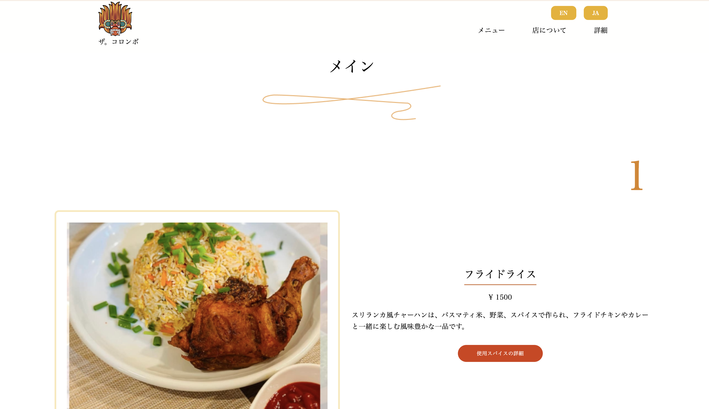

# Za.Colombo  
Sri Lankan Restaurant Web Site 🍛🌿

## 🎓 2025年2月 進級展作品  
Trident College – Web制作作品  

---

## 🔗 作品リンク  
[👉 Za.Colombo Webサイトを開く](https://hashi1920.kilo.jp/colombo/)

## 📍 実店舗情報（架空）  
名古屋市栄｜スリランカ家庭料理

- 大須観音駅から135m  
- 代表的なスリランカライス&カレー  
- スリランカ人オーナーが経営するレストランで、本場スリランカ料理の味をお届けします。  
- スリランカ特有のスパイスとレシピを使って丁寧に作られている。

## 🗓️ 制作期間  
3ヶ月（2024年10月〜2025年1月）／週3コマ

---

## 🛠️ 使用技術  

## 使用ツール  

---

## ヒアリング

### クライアントが抱える問題
- 料理の材料やスパイスについての質問が多い

### レストランの対象
- もっと多くの日本人のお客様に来て欲しい

### 配色

- メインカラー: #ecb00f  
- ベースカラー: #FFFFFF  
- アクセントカラー: #d63d0f

### ロゴ  

### ショップカード  
  
  

---

## 🎯 コンセプト  
外国人と日本人の両方に魅力を伝えるスリランカレストランのWebサイト。  
鮮やかな色使いと伝統的な雰囲気を両立させたデザイン。

---

## 📜 メニュー  
メニューでは、料理の詳細な説明、価格、そして使用されているスパイスを確認できるボタンをご用意しています。
 
--
   

## 📸 こだわりポイント  
- トップページに伝統的な建物と料理の写真を使用  
- 多国籍の人がわかりやすいレイアウト  
- スマホ対応（レスポンシブデザイン）  
- 英語と日本語の両方に対応  
- 料理に使用されているスパイスの詳細を表示  
- スリランカに関する情報とレストランのロゴの説明を提供
 

---

---

